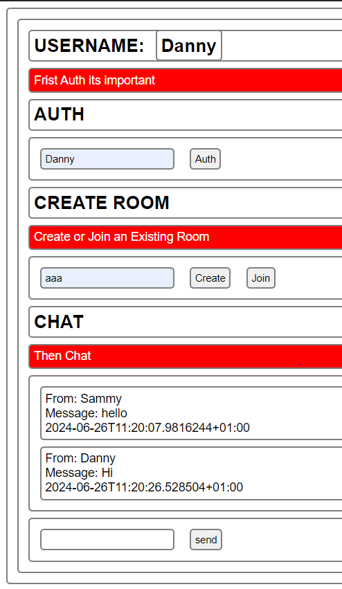

# SignalR Chat System
**This is intended to be used with BI-Directional Web View**

## Setting Up

1. Copy Chat System Files into projecct directory
2. Add Dependency in Program.cs  
**Program.cs**
```c#
	Builder.UseStartup<Startup>();
```
**Startup.cs**
```c#
	public class Startup
    {
        public void ConfigureServices(IServiceCollection services)
        {
            services.AddAuthentication("Cookie")
                .AddCookie("Cookie");

            services.AddSingleton<ChatRegistry>();
            services.AddSingleton<IUserIdProvider, UserIdProvider>();

            services.AddSignalR();
            services.AddControllers();
        }

        public void Configure(IApplicationBuilder app, IWebHostEnvironment env)
        {
            if (env.IsDevelopment())
            {
                app.UseDeveloperExceptionPage();
            }

            app.UseStaticFiles();

            app.UseRouting();

            app.UseAuthentication();

            app.UseAuthorization();

            app.UseEndpoints(endpoints =>
            {
                endpoints.MapHub<ChatHub>("/chat");
                endpoints.MapDefaultControllerRoute();
            });
        }
    }
```

You Can change as needed
## Running
After Running your project in VS or Whatever Method was Chosen
You can access the webPage at:  
[http://localhost:5000/index.html](http://localhost:5000/index.html),    
Get The Demo at: [http://localhost:5000/WorkingChat.html](http://localhost:5000/WorkingChat.html),  
  
This Can be Changed in the wwwroot Folder

## Commands
These Commands can be executed via console or any evaluation method
```javascript
auth(userToken) \\Can Be used to Authenticate Users
send(message) \\Send Message
create(createsRoom) \\Creates A Room
join(RoomName) \\JoinRoom
leave() \\Disconnects from Room
```
### This is not secure by any means
You can Secure it by modifying *ChatSystem/DefaultController/Authenticate* to fit your project
```C#
[AllowAnonymous]
[HttpGet("/auth")]
public IActionResult Authenticate(string username)
{
    var claims = new Claim[]
    {
        new("user_id", Guid.NewGuid().ToString()),
        new("username", username),
    };

    var identity = new ClaimsIdentity(claims, "Cookie");
    var principal = new ClaimsPrincipal(identity);

    HttpContext.SignInAsync("Cookie", principal);
    return Ok();
}
```

## Accessing Functions

### Flutter

```dart
    flutterWebviewPlugin.evalJavascript('auth("MyUserAuthToken")')
```

### HTML

You can probably write some additional js
```html
    <button onclick="DoSomthing()">Click to Auth</button>
    <script src="mychatAdditional()"></stript>
```
*mychatAdditional.js*
```
    DoSomthing(){
        auth("MyUserAuthToken")
    }
```
### Razor
Move Contents of *index.html* to *myFile.razor*

### Maui

lookHere -> [js-net-interact-on-maui-webview](https://stackoverflow.com/questions/73217992/js-net-interact-on-maui-webview)
